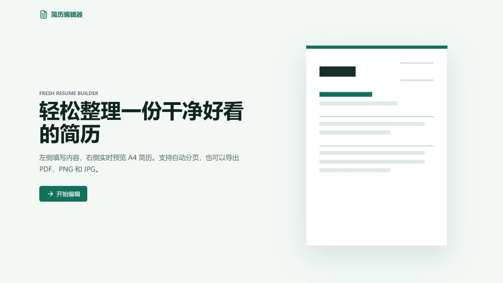
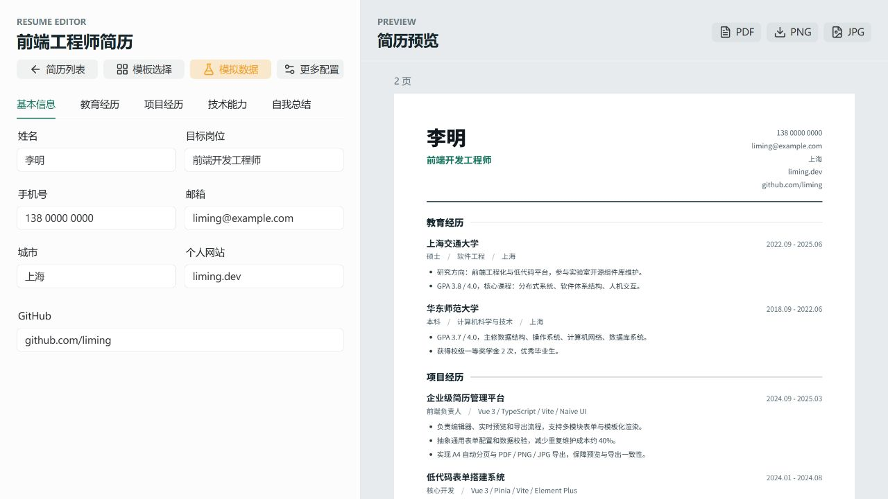
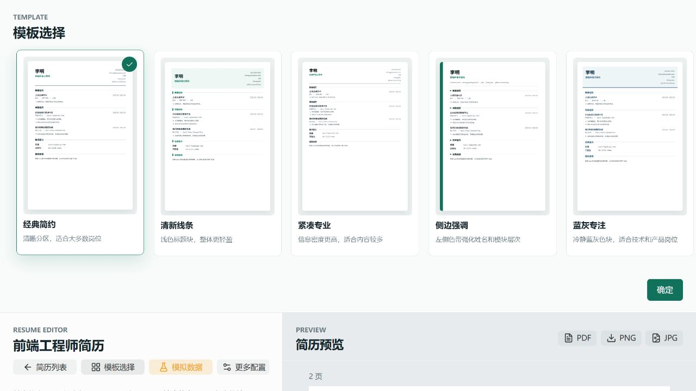

# 简历编辑器

一个专注中文简历制作的在线编辑器。无需注册账号，打开浏览器即可完成简历创建、实时预览、模板切换和多格式导出。

[在线体验](https://exooool.github.io/resume/) · [功能概览](#功能概览) · [本地运行](#本地运行)



## 项目亮点

- **所见即所得**：左侧填写内容，右侧同步生成 A4 简历，修改结果即时可见。
- **自动分页**：根据内容高度自动拆分页面，适合经历较多的完整简历。
- **9 套模板**：覆盖经典、清新、紧凑、侧边栏、蓝灰、墨线、卡片、时间轴和极简风格。
- **多格式导出**：支持导出 PDF、PNG 和 JPG，方便投递、打印或分享。
- **本地优先**：简历数据保存在浏览器 `localStorage`，无需后端服务，也不会上传个人信息。
- **响应式编辑**：桌面端采用双栏编辑，窄屏设备可在编辑与预览之间快速切换。

## 产品截图

### 实时编辑与 A4 预览

表单内容会同步渲染到右侧简历，预览区域展示真实分页结果，并提供 PDF、PNG、JPG 导出入口。



### 多模板切换

模板选择器会用同一份简历内容生成缩略预览，便于直接比较不同排版风格。



## 功能概览

| 模块 | 能力 |
| --- | --- |
| 简历管理 | 新建、命名、继续编辑、删除多份简历 |
| 内容编辑 | 基本信息、教育经历、项目经历、技术能力、自我总结 |
| 个人头像 | 本地图片上传、4:5 自动裁剪、更换和移除，无头像时不占位 |
| 动态表单 | 教育和项目支持多项增删，模块内容可折叠整理 |
| 技术能力 | 支持分类模式和自由文本模式 |
| 实时预览 | A4 尺寸渲染、内容测量、自动分页、页数提示 |
| 模板系统 | 9 套内置模板，一键预览和切换 |
| 文件导出 | PDF、PNG、JPG |
| 数据持久化 | 浏览器本地自动保存，刷新后可继续编辑 |
| 响应式布局 | 桌面双栏与移动端编辑/预览切换 |

## 使用流程

1. 进入简历列表并创建一份新简历。
2. 按模块填写个人信息、教育经历、项目经历和技能。
3. 在实时预览中检查分页与内容密度。
4. 打开模板选择器，比较并确定排版风格。
5. 导出 PDF 用于投递，或导出图片用于分享。

开发环境中可以点击“模拟数据”快速填充完整示例，便于测试模板和分页效果。

## 技术栈

| 技术 | 用途 |
| --- | --- |
| Vue 3 + TypeScript | 组件开发、类型约束和响应式状态管理 |
| Vite | 本地开发与生产构建 |
| Vue Router | 首页、简历列表和编辑器页面路由 |
| Naive UI | 表单、按钮、弹窗和基础交互组件 |
| Lucide | 界面图标 |
| html2canvas | 将简历页面渲染为图片 |
| jsPDF | 生成 PDF 文件 |

## 本地运行

环境要求：Node.js 20.19+ 或 22.12+，以及随 Node.js 安装的 npm。

```bash
git clone https://github.com/exooool/resume.git
cd resume
npm install
npm run dev
```

浏览器访问终端输出的本地地址，默认通常为 `http://localhost:5173`。

## 可用命令

```bash
# 启动开发服务器
npm run dev

# 类型检查并构建生产版本
npm run build

# 本地预览生产构建
npm run preview
```

## 项目结构

```text
src/
├─ components/     # 表单、预览、模板选择等核心组件
├─ composables/    # 编辑器状态、分页测量与导出逻辑
├─ data/           # 默认简历数据和模板配置
├─ router/         # 页面路由
├─ utils/          # 简历转换与本地存储工具
├─ views/          # 首页、简历列表、编辑器页面
├─ App.vue
├─ main.ts
└─ styles.css
```

## 数据与隐私

简历数据以 JSON 形式保存在当前浏览器的 `localStorage` 中。项目不依赖账号系统或远程数据库，个人信息不会由应用主动上传。

这也意味着数据只存在于当前浏览器环境：清理站点数据、使用无痕窗口或更换设备后，原有简历不会自动同步。加入头像、附件、历史版本等大体量数据后，可以进一步迁移到 IndexedDB 或接入可选的云端同步。

## 构建与部署

```bash
npm run build
```

构建产物输出到 `dist/`。仓库已配置 GitHub Actions，可在推送到 `main` 分支后自动构建并发布到 GitHub Pages；生产构建会将 Vite 基础路径设置为 `/resume/`。
